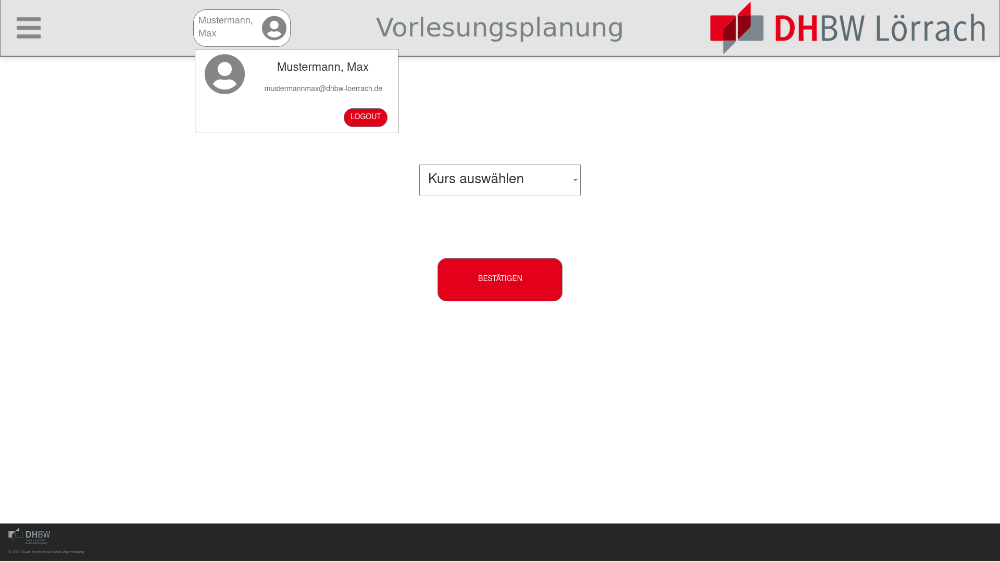
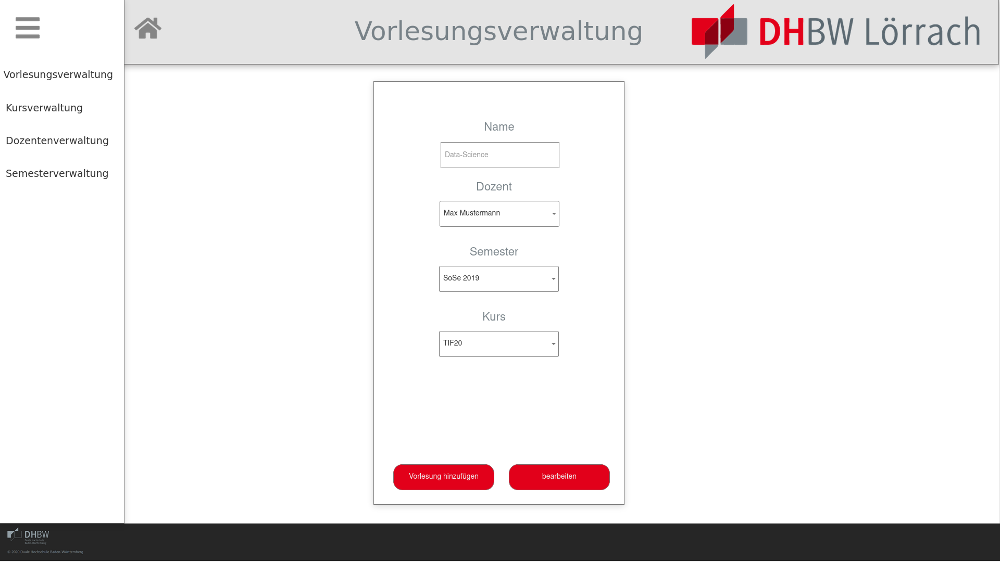
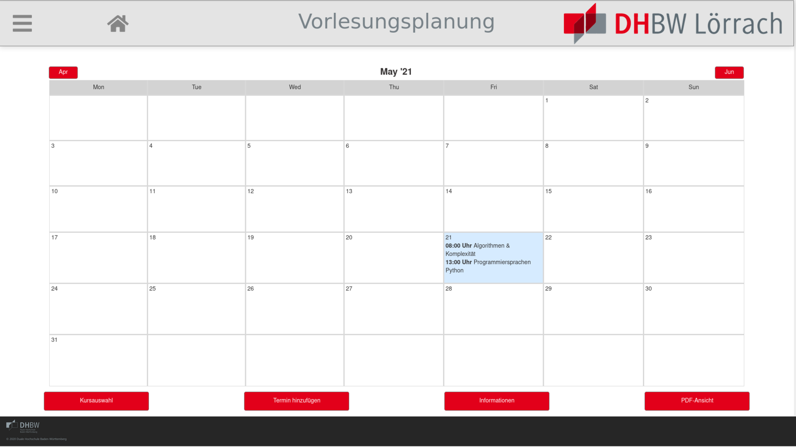
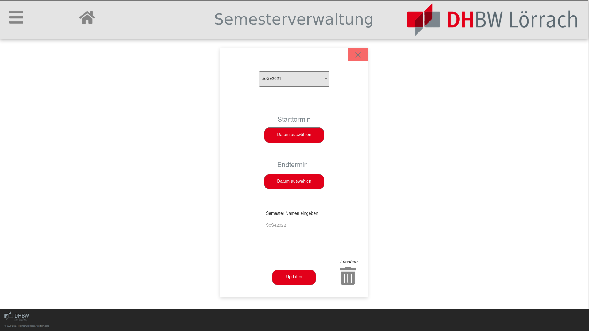

# Pflichtenheft 

Vorlesung: Anwendungsprojekt Informatik

Zuständige Dozierende: Fr. Dr. Kristina Birn & Hr. Prof. Dr. Erik Behrends

Kurs: TIF20A

Projekt: Webanwendung zur Vorlesungsplanung

Gruppenmitglieder:
- Bieringer, Christoph Karlhans Otto
- Krüger, Jennifer Laureen
- Kubon, Benedikt Daniel
- Meier, Jannic
- Weishar, Luc Rémi
- Zaremba, Fabian

## Einleitung

Ausgangssituation ist die zeitaufwändige manuelle Planung von Vorlesungsterminen mittels Tischkalender und manueller Absprache des Sekretariats mit einzelnen Dozenten.

- Zeitaufwendige manuelle Organisation und Verschiebung von Vorlesungsterminen
- Häufige Absprachen zwischen Dozent / Sekretariat
- Planung mit internen / externen Dozenten unterschiedlich
- Arbeitsmittel bisher: Tischkalender & Bleistift

Ziel des Projektes ist eine Minimierung des personellen Aufwandes zur Organisation der Vorlesungsterminen eines oder mehrerer Kurse.
Umgesetzt werden soll eine grundlegenden Konzeptionierung und die Implementierung eines entsprechenden Webanwendungsprototypen.
Dabei soll der zeitliche und organisatorische Aufwand um t-n Zeiteinheiten, gegenüber dem bisherigen Zeitaufwand t, reduziert werden.

Ein Prototyp / MVP soll bis einschließlich den 20. Juni 2021 durch den Lenkungskreis und das Kernteam, sowie mithilfe der internen und externen Fachpromotern, realisiert und den Stakeholdern zur weiteren Evaluierung zur Verfügung gestellt werden.

Besonderer Kundennutzen:
- Erhöhung der organisatorischen Effizienz (Verringerung des Zeitaufwandes)
- Steigerung der Attraktivität der DHBW für Dozenten
- Überführung analoger Planungsprozesse des Studienbetriebes in digitale Lösungenansätze zur Vereinheitlichung der Optimierung der Planungsabläufe

## Technische Lösung

### Rahmenbedingungen

- Umsetzung als Free / Libre Open Source Software unter MIT Lizenz

  Freie Software räumt dem Nutzer diverse Freiheiten ein, z.B. das Programm zu jedem Zweck auszuführen, den eigenen Bedürfnissen anzupassen und weiterzuverbreiten.
  Diese Verbesserungen und der Quellcode insgesamt sollen i.d.R. ebenfalls frei weitergegeben werden. Information und Wissen sollte frei zugänglich sein.
  Freie Software bietet den Vorteil, dass auch nicht am Projekt beteiligte Dritte von dem Aufbau und der Programmierung der Software lernen und davon profitieren können.
  Außerdem kann eine Community entstehen, die das Projekt weiterentwickelt. Aus diesen Überlegungen stellen wir unser Projekt ebenfalls als freie Software zur Verfügung.

- Projektorganisation und Management mit OpenProject (Eigene Instanz auf bwCloud)

  Als Projektplanungstool wird eine selbst gehostete Instanz von OpenProject verwendet.
  Das Tool ist kostenfrei, gut dokumentiert und bietet den vollen benötigten Funktionsumfang.
  Z.B. werden auch Gantt Charts und Integration in Git mit Keywords in Commit Messages ohne Plugins unterstützt.

- Organisatorische Diagramme mit draw.io (https://app.diagrams.net/)

  Für Diagramme verwenden wir draw.io auf Grund der Verfügbarkeit als Browseranwendung für alle Plattformen und des guten Funktionsumfangs.
  Außerdem ist das Tool ebenfalls kostenfrei und als freie Software verfügbar.
  Insbesondere ist auch ein Export in freie und kompatible Dateiformate (SVG) möglich, sowie das mitverwalten von Quelldateien in einem portablen XML Format in der Versionskontrolle.

- Dokumentation im Markdown Format

  Markdown ermöglicht eine einfache Bearbeitung der Dokumentationsdateien in einem menschenlesbaren, plattformübergreifend kompatiblen Textformat.
  Die Dokumentationsdaten können in verschiedenen Tools (VCS, OpenProject Wiki) verwaltet und auch ohne technisches Vorwissen geschrieben werden.
  Außerdem bietet GitHub eine native Unterstützung für das Rendering von Markdown im Userinterface an.


### VCS & Hosting

- Öffentliche Versionskontrolle (VCS) mit Git, Hosting durch GitHub

  Git ist ein verteiltes Versionskontrollsystem, das als freie Software erhältlich ist. Es erfordert keine dauerhafte Verbindung zum Server und eignet sich dadurch auch für Umgebungen mit schlechter Internetverbindung.
  Die Entwicklung muss nicht linear verlaufen, sondern kann über verschiedene Branches und Merge Strategien im Team gesteuert werden.
  Die Dateiversionierung ordnet jedem Stand der Projektdateien einen eindeutigen Hash zu, wodurch referenzierbare Versionierung entsteht.
  Außerdem können Änderungen jederzeit eingesehen und bei Bedarf auch rückgängig gemacht werden.
  GitHub ist der bekannteste Git Hostinganbieter mit Webfrontend. Unser Projekt nutzt dort kostenloses Hosting sowie die angebotene CI Plattform.

- Continuous Integration (Build & Statische Analyse) mit GitHub Actions

  Continuous Integration führt bei jeder Aktualisierung der Versionskontrolle definierte Aktionen (Build sowie diverse statische Analysen für Backend und Frontend) aus um Flüchtigkeitsfehler bestmöglich zu reduzieren.
  Als CI Anbieter verwendet dieses Projekt GitHub Actions auf Grund des großen Funktionsumfanges sowie der Integration in GitHub.
  Die verwendete Konfiguration wäre einfach zu anderen Anbietern zu portieren.

- Serverbetriebssystem Debian 11 Bullseye

  Debian hat sich als einer der großen Standards bei der Auswahl von Serverbetriebssystemen etabliert.
  Insbesondere ist die Distribution kostenfrei erhältlich, legt Wert auf die Auswahl freier Software in den Paketquellen und bietet zeitnahe sowie langfristige Sicherheitsupdates.
  Debian 11 Bullseye befindet sich zum Zeitpunkt der Erstellung dieses Dokumentes im "Hard Freeze" vor dem eigentlichen Release und durchläuft somit keine gravierenden Änderungszyklen mehr.

- Hostingplatform bwCloud (OpenStack, Verwaltung durch OpenSSH)

  bwCloud ist ein IaaS Angebot für Forschung und Lehre in Baden-Württemberg basierend auf OpenStack und Ceph.
  Die uns im Rahmen des Studiums zur Verfügung gestellten Ressourcen eignen sich optimal zum Hosting des Projektmanagements und des daraus resultierenden Prototypes.
  Dabei können im Kontingent diverse virtuelle Server erstellt werden, die dann regulär über eine VNC Konsole im Browser oder über OpenSSH verwaltet werden können.

- Einhaltung von Datenschutzstandards nach DSGVO
  
  Hosting in deutschen Rechenzentren über Hochschulinfrastruktur & Verzicht auf Drittanbieter (keine Notwendigkeit von Auftragsdatenverarbeitung)
  

### Datenbank

- Relationales Datenbankschema & EER Modell mit MySQL Workbench

  Die Verwendung einer relationalen Datenbank ermöglicht die Definition einer konkreten Datenstruktur und die Modellierung von Beziehungen einzelner Datensätze.
  Über Foreign Key Constraints kann der verwendete Datenbankserver diese Beziehungen dauerhaft prüfen und eine kohärente Datenstruktur auch bei langfristigem Einsatz der Software aufrechterhalten.
  Ein EER Modell kann diese Beziehungen graphisch sichtbar machen und verständlich darstellen.

- Datenbankserver MariaDB

  MariaDB ist ein Fork der MySQL Datenbanksoftware, der auf Grund der Übernahme von MySQL durch Oracle entstanden ist.
  Ziel der Community ist die Bereitstellung eines freien Datenbankservers mit hoher Stabilität, guter Performance und Binärkompatibilität mit MySQL.
  Die Entwicklung neuer Features weicht von MySQL ab.

### Backend

- Backendentwicklung mit Go (memory-safe, high performance)

  Die Programmiersprache Go wird maßgeblich von Google entwickelt und ist ebenfalls freie Software. Sie ist fokussiert auf Sicherheit, Kompatiblität und eine gute Entwicklererfahrung.
  Go ist speichersicher, stark typisiert und bietet Elemente, die eine einfache parallele Programmierung ermöglicht. 
  Dadurch eignet die Sprache sich insbesondere für die Entwicklung von Webservern, da die umfangreiche Standardlibrary bereits einen hochperformanten HTTP Server und Unterstützung für einen modernen TLS Stack anbietet.

- Statische Analyse mit integriertem ```go vet``` bzw. ```gopls```

  Statische Analyse ist bereits in der Go Toolchain integriert.
  
- Codeformatierung mit ```go fmt```

  Für Go gibt es einen einheitlichen Formatierungsstandard, wodurch auch mehrere Entwickler ohne Konflikte an derselben Codebase arbeiten können und diese gut lesbar bleibt.

- Race Conditions Testing mit ```go build -race```

  Bei paralleler Programmierung ist es wichtig, entsprechendes Locking und Synchronisierungsprimitiven zu verwenden. Zur Prüfung bietet Go eine integrierte Erkennung von Race Conditions mit einer speziellen Einstellung für den Compiler an.
  Diese Erkennung beeinträchtigt die Performance und wird daher hauptsächlich während der Integrationstests angewendet.

- Keine Abhängigkeiten von C Libraries oder Betriebssystem -> Cross-Platform / Cross-Architecture

  Dieses Projekt ist nicht abhängig von C Libraries oder Details des unterliegenden Betriebssystemes. Diese Aspekte werden von der Go Standardlibrary abstrahiert.
  Daher ist das Backend ohne Anpassungen auf allen von Go unterstützten Plattformen und Betriebssystemen lauffähig.

- HTTP Routing Library github.com/go-chi/chi
- SQL Boilerplate & Mapping mit github.com/jmoiron/sqlx
- SAML2 / Shibboleth SSO Serviceprovider mit github.com/crewjam/saml

  Die angegebenen populären und freien Bibliotheken ergänzen die Standardlibrary um nützliche Features und erhöhen damit die Sicherheit und Geschwindigkeit der Entwicklung im Backend.
  Die Reimplementierung häufig genutzter Features wird damit vermieden.

- REST API mit JSON Payloads zur Kommunikation mit Frontend

  Zur Kommunikation mit dem Frontend kommt eine REST (Representational State Transfer) orientierte API mit JSON (Javascript Object Notation) Payloads zum Einsatz.
  REST definiert einen weitgehend einheitlichen Standard für Anfragen über das reguläre HTTP Protokoll und wird von Browser APIs gut unterstützt.
  Hauptsächlich werden in diesem Projekt GET & POST Requests zum Einsatz kommen. Informationen über die Anfragen oder Antworten werden in Form von JSON enkodiert, so dass eine kompatible Kommunikation zwischen den verwendeten Programmiersprachen ermöglicht wird.

- TLS Mindestversion v1.2 mit Zertifikaten über ACME (CA Let's Encrypt)

  Die verwendeten Sockets werden über TLS in der Mindestversion v1.2 abgesichert. Zertifikate dafür können kostenlos über das ACME Protokoll von der CA Let's Encrypt bezogen werden.
  TLS garantiert die Sicherheit (genauer Integrität und Vertraulichkeit) des ausgelieferten Frontendcodes sowie der Kommunikation zwischen Frontend & Backend.
  Kommunikation über den HTTP Port 80 wird weitergeleitet auf den TLS gesicherten HTTPS Port 443.
  Die Verwendung der Mindestversion v1.2 vermeidet Sicherheitsprobleme in früheren SSL / TLS Versionen auf Kosten der Kompatiblität mit sehr alten Clients (z.B. Android < v4)

### Frontend

- HTML5, CSS3

  HTML5 (Hypertext Markup Language) ist eine deklarative Markupsprache für den strukturierten Aufbau von Websiten und Webanwendungen.
  CSS3 (Cascading Style Sheets) wird verwendet, um HTML Elemente nach Selektoren unterteilt mit bestimmten Gestaltungen zu versehen.
  Beide Sprachen werden als Living Standard von dem W3C Konsortium verschiedener Browserhersteller entwickelt.
  Bei der Kombination handelt es sich um die derzeit modernste Möglichkeit zur Entwicklung von Webanwendungen für aktuelle Versionen der meistgenutzten Browserengines (Firefox, Chromium und Safari).

- Erstellung von Mockups & Klickprototypen mit https://mockplus.com

  mockplus.com ermöglicht in der kostenfreien Grundversion die kollaborative und einfache Erstellung von Mockups und Klickprototypen und das Teilen als Weblink.
  Die kollaborativen Funktionalitäten erfordern eine synchrone Abstimmung der beteiligten Interfacentwickler. Außerdem handelt es sich nicht um eine freie Plattform.
  Trotz dieser Kontrapunkte war das Tool im Rahmen unserer Recherchen am Besten geeignet.

- Frontend mit Javascript mit ES Modulen entwickelt nach ECMAScript 2021 Standard

  Der moderne Javascriptstandard bietet praktische und neue Features, die eine zeitgemäße Entwicklung ermöglichen.
  ES Module ermöglichen die modularisierte Verwendung von Javascript Code und die Gliederung von Funktionalität in eine sinnvolle Struktur.

- Package Management mit NPM

  - Paketverwaltung und angepasste Scripts für wiederkehrende Tasks (Builds, Lint, etc.)
  - Updatemanagement von Abhängigkeiten

- Babel als Transpiler (mit preset-env und browserquery für target >= 0,25% Market & not dead)

  Babel ist in der Lage, die verwendeten modernen Standards und Sprachfeatures so zu verarbeiten, dass sie von einem definierten Satz an Browser verarbeitet werden können.
  Dazu verwenden wir die Module preset-env und browserquery, um das Frontend automatisiert kompatibel mit 99,75% der aktuell reguläre verwendeten Browser zu machen.

- Webpack als Bundler für CSS & JS

  Webpack ermöglicht die Bündelung verschiedener Quelldateien, die entweder im Projekt erstellt oder aus NPM Modulen übernommen werden können.
  Dabei werden sowohl JS als auch CSS Dateien unterstützt und in verschiedenen Einstellungen für die Entwicklung oder für die Produktion (z.B. mit Minifizierung) verarbeitet.

- CSS & JS Komponenten Framework Bootstrap v5

  Das gut unterstützte und regelmäßig weiterentwickelte Webframework Bootstrap ermöglicht eine Reduzierung der nötigen Entwicklungszeit durch Verwendung von bereitgestellten CSS und JS Komponenten.
  Wichtige Funktionen, wie z.B. Navigationsleisten oder Modals werden direkt mit unterstützt und müssen daher nicht in diesem Projekt separat entwickelt werden.

- ESLint mit angepasster Konfiguration zur statischen Analyse

  Statische Analyse des entwickelten Javascript Codes wird über ESLint mit einem speziell angepassten, strengeren Regelsatz durchgeführt.
  Analysen werden manuell während der Entwicklung und regelmäßig im Rahmen der Continuous Integration betrachtet, um häufige Programmierfehler möglichst schnell zu erkennen und abzufangen.

- JSBeautify zur einheitlichen Codeformatierung

  Eine einheitliche Formatierung mittels JSBeautify ermöglicht einen einheitlichen Formatierungsstandard, wodurch auch mehrere Entwickler ohne Konflikte an derselben Codebase arbeiten können und diese gut lesbar bleibt.

- Webfont Roboto, konvertiert mit FontSquirrel
- Iconfont FontAwesome v5

  Die frei verfügbaren und lizenzierten Fonts Robot und der FontAwesome bieten einen einheitlichen, plattformübergreifenden und ansprechenden Look für die Anwendung im Browser.
  Eine gute Auswahl von Icons unterstützt die Entwicklung des Userinterfaces und ermöglicht eine positive User Experience.

## Beschreibung der Anforderungen bzw. Komponenten

### Scope / Anforderungen

#### Must-Haves
- Vorlesungszeitraum zur Planung festlegen
- Kursangabe beziehungsweise Kursauswahl
- Planungsmöglichkeiten der Vorlesung durch die Möglichkeit...
  - ...noch zu planende Vorlesungen mit Namen, Stundenzahl und ggf. mit Prüfungsleistungen zu versehen  
  - ...Termine (innerhalb der jeweiligen Theoriephase) einzutragen, zu berbeiten und zu löschen
  - ...Termine im Kurskalender in Wochen- und/oder Monatsansicht erscheinen zu lassen
  - ...Termine mit einer Start- und einer Endzeit zu versehen, denen ein Vorlesungstitel und den Namen des Dozierenden zu hinterlegen
  - ..., dass Vorlesungen lediglich im Rahmen von 08:00 - 17:00 Uhr zu veranstalten sind
  - ...das mindestens eine Stunde Mittagspause (zwischen 11:30 - 14:00 Uhr) einzuplanen ist
  - ...der Erkennung, ob alle Vorlesungsstunden eingeplant sind
  - ...der Bestätigung des Vorlesungsplanes, sodass dieser endgültig Veröffentlicht werden kann
- Einhaltung der DSGVO für Produktivdaten

#### Nice-to-haves
- Planung für mehrere Kurse
- Einführung optimaler Vorlesungszeiten (von 09:00 - 12:15 Uhr und von 13:00 - 16:15 Uhr)
- Login mit Benutzername und Passwort
- Entwicklung von Prozessen zur Benachrichtigung, Erinnerung und Bestätigung von Terminen
- Raumplanung
- Export als PDF zum Drucken bzw. Versand per E-Mail
- Usability und Vereinfachung: Vorlesungen beginnen und/oder enden immer :00; :15; :30; :45; (mithilfe von Autovervollständigung oder Suchfunktion)

#### Not-Doing (Keine Umsetzung im Basisprojekt)
- E-Mail Ersatz für Individualkommunikation
- Dozierendenmanagement
- Responsive Design (für Geräte mit kleineren Displays bzw. Smartphones im Hochkantformat)
- Backup der Daten
- Benachrichtigung und Erinnerungen für das Sekretariat und/oder der Dozierenden (z.B. per E-Mail)
- Schnittstellen zu anderen Anwendungen (Veröffentlichung über Exchange, Moodle, usw.)

### Lieferobjekt: Mockups / Konzeption

- Konzeption des Userinterfaces mit den oben aufgeführten Features
- Erstellung von Mockups zur Visualisierung und Unterstützung der Anwendungsentwicklung
- Strukturierte Entwicklung der User Experience

#### Vorschau






### Lieferobjekt: Minimum Viable Product / Prototyp

Das MVP bzw. der entwickelte Prototyp soll auf Basis der getroffenen Technologieauswahl und basierend auf den erstellen Konzepten und Mockups einen möglichst großen Teil der geplanten Features abbilden und als funktionsfähige Webanwendung ausgeliefert werden.

- Backend
  - Schnittstelle zu Persistenz bzw. Datenbankserver
  - Zuständig für Datenverarbeitung
  - Auslieferung von Frontendcode (HTML / CSS / JS)
  - Schnittstelle zu Frontend (REST API)

- Frontend
  - Userinterface
  - HTML5 / CSS3 / JS
  - Entwickelt für aktuelle Browserversionen von Firefox, Chromium und Safari

## Bereitstellung der Mockups und der Webanwendung

- Bereitstellung und Auslieferung der Mockups erfolgt über Screenshots im Rahmen der Dokumentation sowie als Klickprototypen über das Cloudangebot von https://mockplus.com
- Der Prototyp der Webanwendung / das MVP wird funktionsfähig auf einer Serverinstanz der bwCloud bereitgestellt (siehe oben).

## Qualität und Test

- Statische Analyse für Backend & Frontend Code
- Ausschluss von Sicherheitslücken durch OOB Fehler, Memory Safety Problemen und Type Confusion im Backend durch Auswahl der passenden Programmiersprache
- Kontinuierliche statische Prüfung von dynamisch typisiertem JS Code zur Reduzierung von Type Confusion
- Kontinuierliche ausführliche Code Reviews im Team
- Orientierung an OWASP Top 10 und Mitre CWE bei Entwicklung Code Review
- Code soll selbst dokumentierend sein (sprechende Variablennamen), komplizierte Passagen kommentiert

- Manuelle Integrationstests mit festgelegten Testdaten
- Überprüfung von Edge Cases
- Enduser (Alpha / Beta) Testing
- User Experience Validation

## Projektplanung

### Terminplanung

- 07.05.2021: Kontrollabgabe Projektsteckbrief und Projektstrukturplan (Abgabe bei: Prof. Behrends)
- 21.05.2021: Kontrollabgabe überarbeiteter Projektsteckbrief / PSP, Pflichtenheft, Zugang zum PM-Tool für die Einsicht der konkreten und detaillierten Planung für Kunde/Dozenten (Abgabe bei: Prof. Behrends)
- 04.06.2021: Abgabe aller Projektmanagement Dokumentationen auf Moodle bis 17:00 Uhr (Abgabe bei: Dr. Birn)
- 07.06.2021: Elevator Pitch (Referat) ab 14:00 Uhr (Durchführung durch: Dr. Birn, Prof. Behrends)
- 15.06.2021 - 20.06.2021: Projektabschluss und letzte Fragen vor der Abgabe (Abgabe bei: Prof. Behrends)

### Meilensteine

- Einrichtung Infrastruktur (ca. 15.05.2021)
- Konzeption (ca. 26.05.2021)
- Realisierung (ca. 06.06.2021)
- Zwischentests (ca 08.06.2021)
- Abschließende Integrationstests (ca. 10.06.2021)
- User Experience Validierung (aktuell nicht geplant)
- Feature Erweiterung (aktuell nicht geplant)

### Einsatzplanung

| Rolle                | Person                    |
| -------------------- | --------------------------|
| Projektmanager       | Jennifer Krüger           |
| Stellvertreter       | Fabian Zaremba            |
| Technische Leitung   | Fabian Zaremba            |
| Lenkungskreis        | Krüger, Zaremba           |
| Frontendentwicklung  | Weishar, Meier, Kubon     |
| Backendentwicklung   | Zaremba                   |
| API Entwicklung      | Bieringer                 |

## Anhang

### Wartung

- Betrieb mit regelmäßigen Updates über stabile Linuxdistribution für den Servereinsatz (Debian)
  - Bullseye Sicherheitsupdates bis voraussichtlich ca. 2024
  
- Go v1 Kompatiblität ermöglicht langfristigen Betrieb einer sicheren Anwendung ohne großen Wartungsaufwand  

### Weiterentwicklung: Algorithmische Planung

- Weiterentwicklung der Planung von manueller Terminfestlegung
  - Festlegung von Constraints und Darstellung als SAT Problem
  - Verwendung etablierter SAT Solver zur approximativen zeitlich begrenzten Lösung (Partial MaxSAT)
  - Ansatzpunkte siehe auch "Solving the Course-timetabling Problem of Cairo University Using Max-SAT", Mohamed El Halaby (2018), https://arxiv.org/abs/1803.05027
